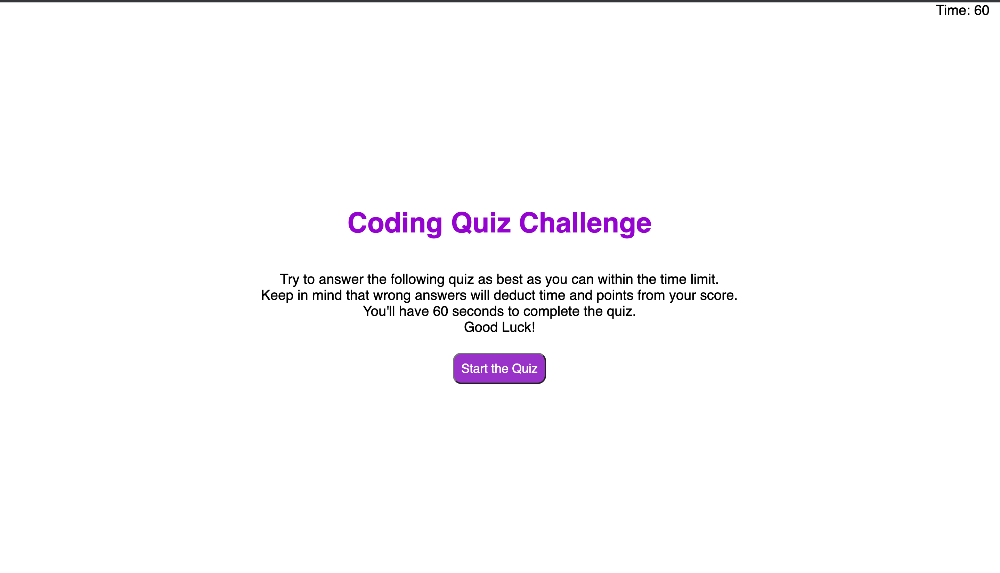
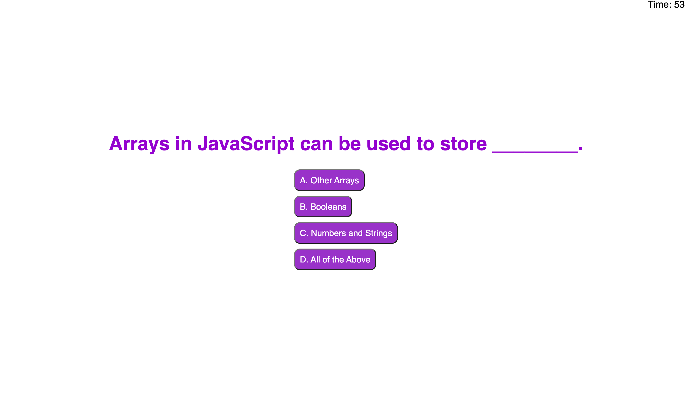
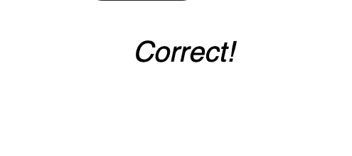
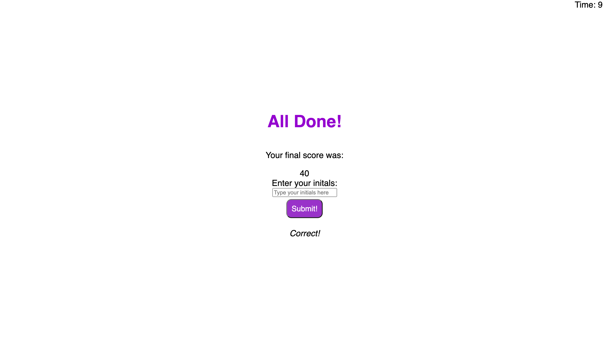
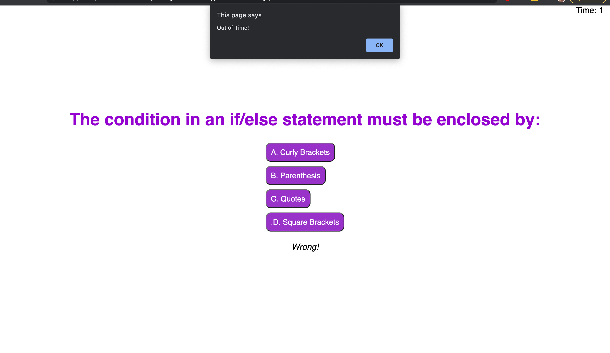
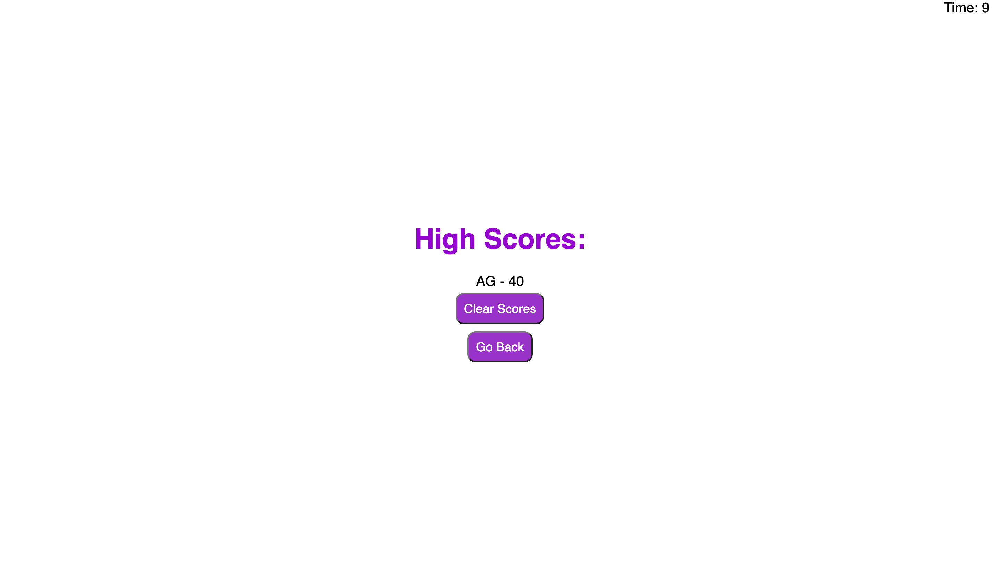

# Javascript Quiz

I developed this website to practice and learn about manipulation of DOM elements using Javascript to show, hide, and mark correct/wrong answers using a time and score system.

## Application

**Click [here](https://iviviana.github.io/JavaScript-Quiz/) to test yourself!**

The first visible DOM should be the start:

Once you have commenced the quiz the start page should disappear and the first question should appear. The timer on the upper right hand will start as well.

Answering each question will prompt a display underneath letting the user known if they answered correctly or incorrectly

When the last question is answered the finished DOM will be displayed showing the user how many points they received and stoping the timer. It will also prompt them to submit their initals.

If the user fails to finish on time a prompt will appear letting the user know they have run out of time. When the user clicks the 'ok' from the prompt the window will reload.

When the user completes the quiz and inputs their initals, they will be shown the highscores DOM, where it will display their highscores. They can clear their scores and/or go back to the start of the quiz from here.

## Contributors

[Antonia Garcia](https://github.com/Iviviana)

